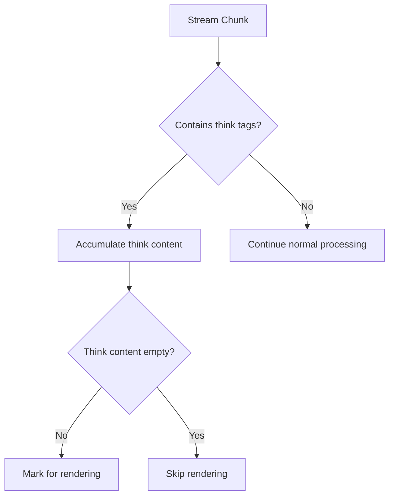
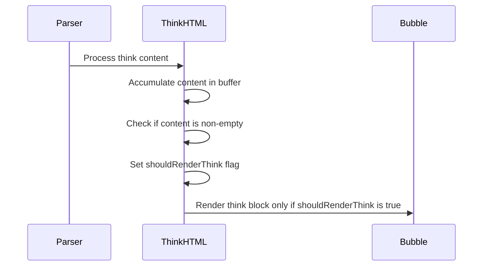

# Think Block Rendering Logic Design

## Overview

This document describes the design for implementing conditional rendering of think blocks in the chat interface. The feature will render think blocks only when the model generates non-empty `<think>` tags, and skip rendering when the tags are missing or empty.

## Current Implementation Analysis

The current implementation has the following components:

1. **Parser (`src/lib/chat/parser/impl.ts`)**: Detects `<think>` and `</think>` tags in the stream and creates HTML segments
2. **Think HTML Renderer (`src/lib/chat/stream/think_html.ts`)**: Handles the rendering of think blocks with UI components
3. **Stream Renderer (`src/lib/chat/stream/render_impl.ts`)**: Coordinates the rendering of different segment types
4. **Bubble Context (`src/lib/chat/stream/bubble_ctx.ts`)**: Manages the state of rendered bubbles

The current implementation always renders a think block when it encounters a `<think>` tag, regardless of whether the content is empty or not.

## Requirements

1. Render think blocks only when:
   - The model generates `<think>` tags
   - The content between `<think>` and `</think>` is not empty
   
2. Do not render think blocks when:
   - The model does not generate `<think>` tags
   - The content between `<think>` and `</think>` is empty

3. Remove all other logic related to think blocks that doesn't align with these requirements

## Design

### 1. Parser Modification

Modify the parser to track think block content and determine if it should be rendered:



### 2. State Management

Add a new state to track whether a think block should be rendered:

```typescript
type BubbleCtx = {
  // ... existing properties
  inThink: boolean;
  thinkBuf: string;  // New: accumulate think content
  shouldRenderThink: boolean;  // New: flag to determine if think block should be rendered
  thinkPre: HTMLElement | null;
  // ... rest of properties
};
```

### 3. Rendering Logic

Modify the think HTML renderer to conditionally render based on content:



## Implementation Plan

### Phase 1: Parser Enhancement

1. Modify `src/lib/chat/parser/impl.ts` to:
   - Accumulate think content in a buffer
   - Determine if the content is non-empty (ignoring whitespace)
   - Set a flag indicating whether the think block should be rendered

### Phase 2: Rendering Logic Update

1. Modify `src/lib/chat/stream/think_html.ts` to:
   - Check the shouldRenderThink flag before rendering
   - Skip rendering if the flag is false
   - Clean up any partially rendered elements if needed

### Phase 3: Context Management

1. Update `src/lib/chat/stream/bubble_ctx.ts` to:
   - Add the new state properties
   - Ensure proper cleanup of state

### Phase 4: Testing and Validation

1. Test with various scenarios:
   - Model generates think tags with content
   - Model generates empty think tags
   - Model does not generate think tags
   - Mixed content scenarios

## Technical Details

### Parser Changes

In `src/lib/chat/parser/impl.ts`, modify the think block handling logic:

1. When encountering `<think>`:
   - Initialize think buffer
   - Set shouldRenderThink to false initially
   - Continue accumulating content

2. When encountering `</think>`:
   - Check if think buffer contains non-whitespace content
   - Set shouldRenderThink flag accordingly
   - Only emit HTML segments if shouldRenderThink is true

### Renderer Changes

In `src/lib/chat/stream/think_html.ts`, modify `appendThinkAwareHtml`:

1. Check context for shouldRenderThink flag
2. Only render HTML elements if the flag is true
3. Skip rendering entirely if the flag is false

## Edge Cases to Consider

1. **Whitespace-only content**: Think blocks with only spaces, tabs, or newlines should not be rendered
2. **Partial content**: In streaming scenarios, initial content might be empty but later content might not be
3. **Nested tags**: Ensure proper handling of other tags within think blocks
4. **State management**: Properly reset state between different messages

## Testing Strategy

1. **Unit Tests**:
   - Test parser with empty think content
   - Test parser with whitespace-only think content
   - Test parser with actual think content
   - Test renderer with shouldRenderThink flag in both states

2. **Integration Tests**:
   - Test complete message flow with various think content scenarios
   - Test multiple think blocks in a single message
   - Test think blocks mixed with other content types

3. **UI Tests**:
   - Verify think blocks are rendered when they should be
   - Verify think blocks are not rendered when they shouldn't be
   - Verify proper styling and interaction in both cases

## Backward Compatibility

This change modifies the behavior of think block rendering but does not break existing APIs. Applications that rely on the current always-render behavior will need to be updated to account for the new conditional rendering logic.