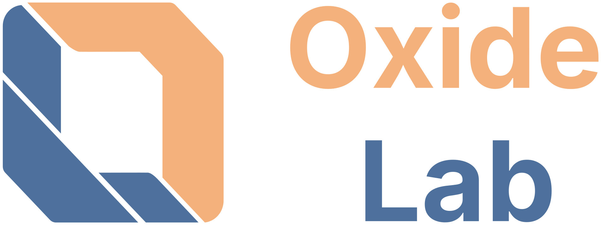
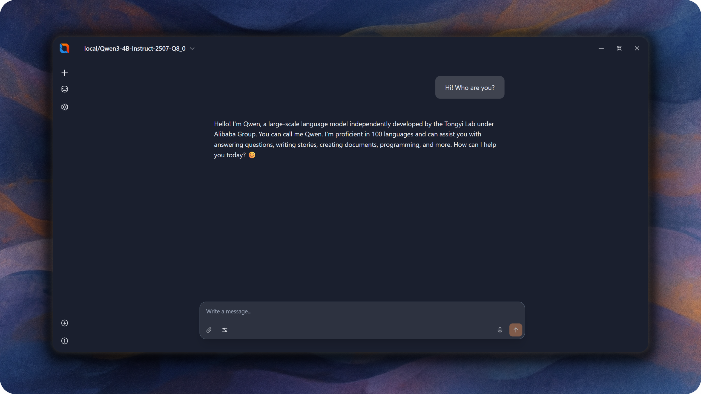

[English](README.md) | [Português (BR)](README-PT-BR.md)

<!-- Логотип проекта -->
<p align="center">
  
  
</p>

> **Приватный, мощный и простой в использовании локальный ИИ‑чат на вашем компьютере**

   

 [](https://github.com/tauri-apps/awesome-tauri) [](https://github.com/TheComputerM/awesome-svelte)

---

## 📚 Содержание

- [Что это?](#-что-это)
- [Для кого это приложение?](#-для-кого-это-приложение)
- [Ключевые возможности](#-ключевые-возможности)
- [Признание](#️-признание)
- [Установка и настройка](#️-установка-и-настройка)
- [Как начать пользоваться](#-как-начать-пользоваться)
- [Особенности интерфейса](#-особенности-интерфейса)
- [Конфиденциальность и безопасность](#-конфиденциальность-и-безопасность)
- [Советы и рекомендации](#-советы-и-рекомендации)
- [Системные требования и ограничения](#-системные-требования-и-ограничения)
- [Поддержать проект](#-поддержать-проект)
- [Благодарности](#-благодарности)

---

## ✨ Что это?

**Oxide Lab** — современное десктоп‑приложение для общения с ИИ‑моделями, которое работает полностью локально на вашем компьютере. Никаких подписок и отправок данных в интернет — только вы и ваш персональный ИИ‑ассистент.

### 🎯 Для кого это приложение?

- **Энтузиасты ИИ** — хотите экспериментировать с моделями локально
- **Про приватность** — ваши данные остаются только у вас
- **Исследователи** — нужен контроль над параметрами генерации
- **Креаторы** — тексты, идеи, мозговой штурм и вдохновение

---

## 🚀 Ключевые возможности

### 💬 **Умный чат‑интерфейс**

- Современный и понятный дизайн
- Потоковые ответы в реальном времени
- Поддержка форматирования текста и кода

### 🧠 **Режим размышления**

- Включайте **«Размышления»** и наблюдайте ход мыслей ИИ
- Видно анализ перед итоговым ответом
- Более качественные и продуманные решения сложных задач

### ⚙️ **Гибкие настройки**

- **Температура** — креативность ответа
- **Top‑K, Top‑P, Min‑P** — тонкая настройка стиля генерации
- **Repeat Penalty** — меньше повторов
- **Длина контекста** — зависит от модели и ресурсов устройства

### 🔧 **Простая настройка**

- Поддержка локальных моделей Qwen3 в формате GGUF (другие — в планах)
- Интеллектуальное управление памятью

---

## 🎖️ Признание

Oxide Lab получил признание сообщества за качество и инновации:

- ⭐ **100+ звезд на GitHub** за первые 3-4 месяца соло-разработки
- 🏆 **Попал в [Awesome Tauri](https://github.com/tauri-apps/awesome-tauri)** — кураторский список качественных приложений на Tauri
- 🏆 **Попал в [Awesome Svelte](https://github.com/TheComputerM/awesome-svelte)** — кураторский список качественных проектов на Svelte

---

## 🛠️ Установка и настройка

### Необходимые компоненты

Перед установкой Oxide Lab убедитесь, что у вас установлены:

- **Node.js** (версия 18 или выше) - [Скачать](https://nodejs.org/)
- **Rust** (последняя стабильная версия) - [Установить](https://rustup.rs/)
- **Git** - [Скачать](https://git-scm.com/)

#### Для GPU ускорения (Опционально, но рекомендуется)

- **CUDA 12.0+** для NVIDIA GPU (Windows/Linux)

### Шаги установки

1. **Клонируйте репозиторий:**

   ```bash
   git clone https://github.com/FerrisMind/Oxide-Lab.git
   cd Oxide-Lab
   ```

2. **Установите зависимости:**

   ```bash
   npm install
   ```

3. **Запустите в режиме разработки:**

   ```bash
   # Для режима только CPU
   npm run tauri:dev:cpu

   # Для режима CUDA GPU (если CUDA доступна)
   npm run tauri:dev:cuda
   ```

4. **Сборка для продакшена:**

   ```bash
   # Сборка только CPU
   npm run tauri:build:cpu

   # Сборка CUDA
   npm run tauri:build:cuda
   ```

### Системные требования

- **ОС:** Windows 10/11, Linux, macOS
- **ОЗУ:** Минимум 4ГБ, Рекомендуется 8ГБ+
- **Хранение:** 500МБ для приложения + размер модели
- **GPU:** Опционально, но рекомендуется для лучшей производительности

### Устранение неисправностей

- При проблемах со сборкой убедитесь, что Rust и Node.js правильно установлены
- Для поддержки GPU проверьте установку CUDA
- Проверьте страницу [Issues](https://github.com/FerrisMind/Oxide-Lab/issues) на наличие распространенных проблем

---

## 📖 Как начать пользоваться

### 1️⃣ **Скачайте модель**

Загрузите модель в формате `.gguf` и файл `tokenizer.json`:

- **Рекомендуемые модели:** Qwen3 4B (и другие варианты Qwen3 в GGUF)
- **Где скачать:** [Hugging Face](https://huggingface.co/collections/Qwen/qwen3-67dd247413f0e2e4f653967f), официальные репозитории моделей

### 2️⃣ **Загрузите в приложение**

1. Откройте Oxide Lab
2. Нажмите **«Выбрать файл модели»** и укажите путь к `.gguf` файлу
3. При необходимости настройте параметры инференса
4. Нажмите **«Загрузить»**

### 3️⃣ **Начните диалог**

- Введите вопрос или запрос
- Включайте **«Размышления»** для более глубоких ответов
- Подбирайте параметры генерации под себя
- Наслаждайтесь диалогом с вашим персональным ИИ!

## 🗂️ Карточки поддерживаемых моделей

Oxide Lab умеет подгружать только проверенные модели. Все карточки, по которым происходит загрузка, хранятся в корневом файле `models/model_cards.json`. Оттуда бэкенд автоматически читает список доступных репозиториев Hugging Face и реализует скачивание в формате `.gguf` и/или `.safetensors`.

### Как добавлять свою карточку

1. Создайте новую запись с уникальным `id` и кратким `name`.
2. Укажите `hf_repo_id` (например, `meta-llama/Llama-3-8B-Instruct`) и, если необходимость, `revision`.
3. Повесьте теги и `family`, чтобы фильтровать модели на вкладке «Поиск моделей».
4. Добавьте `supported_formats`, например `["gguf","safetensors"]`, и настройте `gguf`/`safetensors`-блоки:
   - `gguf.files` — массив с файлами `.gguf` и `tokenizer.json`, которые требуется скачать.
   - `safetensors.weight_files` — список `.safetensors` (можно оставить один файл `model.safetensors`), а также `tokenizer_file` и `config_file`.

5. После сохранения перезапустите приложение, чтобы библиотека заново прочитала карточки.

## В рамках текущей поставки включены карточки для Llama 3, Mistral 7B, Mixtral 8x7B, Gemma 2, Qwen 3.5, Phi 3 и Yi 2. Вы можете наращивать список, уверяя, что файлы указаны точно также, как они лежат в репозитории Hugging Face.

## 🎨 Особенности интерфейса

### 📊 **Информативные индикаторы**

- Прогресс загрузки модели с этапами
- Статусы генерации
- Визуализация «размышлений» ИИ

<p align="center">
  
</p>

### ⚡ **Быстрые действия**

- Отмена загрузки модели в один клик
- Остановка генерации в любой момент
- Быстрая смена параметров без перезагрузки

---

## 🛡️ Конфиденциальность и безопасность

### 🔒 **100% локально**

- Все вычисления происходят на вашем компьютере
- Нет внешних запросов и отправки данных
- Полный контроль над вашей информацией

### 💾 **Управление данными**

- Диалоги хранятся только в рамках сессии приложения
- Модели остаются на вашем диске
- Никакого скрытого сбора данных

---

## 💡 Советы и рекомендации

### 🎯 **Для лучшего результата:**

- Включайте режим размышлений для сложных задач
- В приложении уже подобраны оптимальные настройки согласно рекомендациям производителя модели Qwen3. Просто включайте и пользуйтесь!
- Также поддерживается изменение настроек по умолчанию. Экспериментируйте с температурой: 0.7-1.0 для креативности, 0.1-0.3 для точности
- Увеличивайте контекст для работы с длинными документами

### ⚡ **Оптимизация производительности:**

- Поддерживаются CPU и GPU (CUDA)

### 🎨 **Творческое использование:**

- Включайте «размышления» для анализа текста и решения задач
- Пробуйте высокую температуру для креативного письма
- Используйте длинный контекст для больших документов

---

## 🖥️ Системные требования и ограничения

### Поддерживаемые платформы

- Windows 10/11 — полная поддержка
- Linux и macOS — в планах (пока не поддерживаются)

### Модели

- Поддерживаются: Qwen3 в формате GGUF (моно‑архитектура)
- Важно: совместимость с другими моделями пока не гарантируется

### Минимальные требования к аппаратному обеспечению

Самые маленькие модели Qwen3 (0.6B и 1.7B) работают с приемлемой скоростью и качеством даже на устройствах с 2-ядерным CPU и 4 ГБ ОЗУ. Модель 4B также работает в этом приложении с такими устройствами, но производительность во много раз ниже и требует больше памяти, что трудно достичь, например, в LM Studio без значительной потери качества.

### Контекст и производительность

- Эффективная длина контекста зависит от выбранной модели и доступной ОЗУ
- Практически достижимая длина контекста может быть ниже теоретически заявленной
- Чем больше контекст, тем выше требования к памяти и ниже скорость генерации

---

## 🌟 Поддержать проект

Если Oxide Lab оказался полезным:

- ⭐ Поставьте звезду репозиторию
- 🐛 Сообщите об ошибках
- 💡 Предложите новые функции
- 🤝 Поделитесь с друзьями

---

## 🙏 Благодарности

Oxide Lab создан с помощью замечательных технологий с открытым исходным кодом:

- **[Rust](https://www.rust-lang.org/)** - Системный язык программирования, гарантирующий безопасность памяти и производительность
- **[Tauri](https://tauri.app/)** - Фреймворк для создания быстрых и безопасных десктоп-приложений
- **[Candle](https://github.com/huggingface/candle)** - Минималистичный ML-фреймворк для Rust
- **[Phosphor Icons](https://phosphoricons.com/)** - Красивый и последовательный набор иконок

---

> **Сделано с ❤️ для сообщества энтузиастов ИИ**  
> _Свобода, приватность и контроль над искусственным интеллектом_
