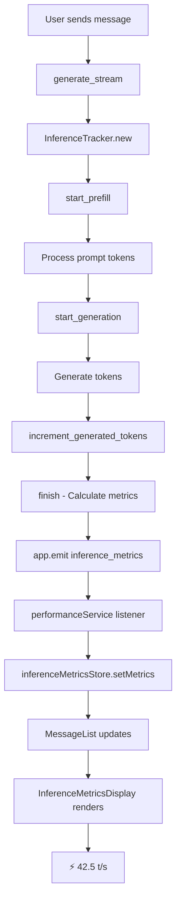

# ✅ Полная интеграция мониторинга производительности

## Обзор реализации

Система мониторинга производительности **полностью реализована** и интегрирована во все части приложения:

- ✅ Backend (Rust) - отслеживание метрик
- ✅ Frontend (TypeScript/Svelte) - отображение метрик
- ✅ UI компоненты - красивое оформление

## Что реализовано

### 🔧 Backend (Rust)

#### 1. Модуль производительности (`src-tauri/src/core/performance.rs`)

- ✅ `PerformanceMonitor` - главный монитор метрик
- ✅ `ModelLoadTracker` - трекер загрузки моделей
- ✅ `InferenceTracker` - трекер inference
- ✅ `PerformanceTimer` - точные измерения времени
- ✅ Мониторинг памяти через `sysinfo`

#### 2. Интеграция в загрузку моделей (`src-tauri/src/api/model_loading/gguf.rs`)

- ✅ Отслеживание стадий загрузки
- ✅ Измерение времени каждой стадии
- ✅ Расчёт использования памяти (до/после/дельта)
- ✅ Отправка метрик на фронтенд через Tauri events

#### 3. Интеграция в генерацию (`src-tauri/src/generate/stream.rs`)

- ✅ Отслеживание prefill и generation
- ✅ Подсчёт токенов (prompt + generated)
- ✅ Расчёт скорости (токены/сек)
- ✅ Мониторинг памяти
- ✅ Отправка метрик после каждого ответа

#### 4. API команды (`src-tauri/src/api/performance_api.rs`)

```rust
get_performance_metrics()      // Получить все метрики
get_average_duration()          // Средняя длительность операции
get_memory_usage()              // Текущая память
clear_performance_metrics()     // Очистить метрики
```

### 🎨 Frontend (TypeScript/Svelte)

#### 1. Типы (`src/lib/types/performance.ts`)

```typescript
PerformanceMetric; // Базовая метрика
ModelLoadMetrics; // Метрики загрузки модели
InferenceMetrics; // Метрики inference
PerformanceSummary; // Сводка производительности
```

#### 2. Сервис (`src/lib/services/performance-service.ts`)

```typescript
performanceService.getPerformanceMetrics(); // Получить метрики
performanceService.getMemoryUsage(); // Текущая память
performanceService.setupEventListeners(); // Подписка на события
performanceService.formatSpeed(); // Форматирование скорости
performanceService.formatDuration(); // Форматирование времени
performanceService.formatMemory(); // Форматирование памяти
```

#### 3. Store (`src/lib/stores/inference-metrics.ts`)

- ✅ Хранение метрик по индексам сообщений
- ✅ Реактивное обновление UI
- ✅ Методы управления (set, get, clear)

#### 4. UI Компоненты

**`InferenceMetricsDisplay.svelte`** - компактное отображение метрик:

```svelte
<InferenceMetricsDisplay {metrics} compact={true} />
```

Отображение:

```
⚡ 42.5 t/s
```

или в расширенном режиме:

```
⚡ 42.5 t/s | Токены: 150 | Время: 3.5s | Память: 2.3 GB
```

### 🔄 Интеграция в чат

#### `MessageList.svelte`

- ✅ Автоматическое отображение метрик под ответами ассистента
- ✅ Использование Svelte 5 рун ($bindable, $derived)
- ✅ Реактивное обновление при получении новых метрик

#### `Chat.svelte`

- ✅ Подписка на события Tauri
- ✅ Обновление store при получении метрик
- ✅ Очистка слушателей в `onDestroy`

## Поток данных



## Метрики, которые отображаются

### Загрузка модели

- ⏱️ Общее время загрузки
- 📊 Время каждой стадии
- 💾 Использование памяти (до/после/дельта)
- 📏 Размер модели в MB

### Inference

- ⚡ **Скорость генерации (токены/сек)** - главная метрика
- 🔢 Количество prompt токенов
- 🔢 Количество сгенерированных токенов
- ⏱️ Общее время
- ⏱️ Время prefill
- ⏱️ Время generation
- 💾 Использование памяти

## Примеры использования

### В чате (автоматически)

После настройки системы метрики автоматически появляются под каждым ответом:

```
User: Напиши функцию на Python

Assistant: [Код функции Python...]

⚡ 45.2 t/s
```

### Программный доступ

```typescript
import { performanceService } from '$lib/services/performance-service';
import { inferenceMetricsStore } from '$lib/stores/inference-metrics';

// Получить сводку
const summary = await performanceService.getPerformanceSummary();
console.log('Скорость:', summary.last_inference.tokens_per_second, 't/s');

// Получить метрики конкретного сообщения
const metrics = inferenceMetricsStore.getMetrics(messageIndex, metricsMap);
```

## Зависимости

### Rust (Cargo.toml)

```toml
sysinfo = "0.33"         # Системная информация
chrono = { version = "0.4", features = ["serde"] }  # Временные метки
tokio = { version = "1", features = ["sync", "time"] }  # Async
```

### TypeScript (package.json)

```json
"@tauri-apps/api": "^2.0.0"  // Tauri API для invoke и events
```

## Тестирование

### Проверка backend

```bash
cd src-tauri
cargo check  # Компиляция без ошибок
cargo test   # Тесты (если есть)
```

### Проверка frontend

```bash
npm run check    # TypeScript и Svelte проверка
npm run lint     # ESLint
npm run build    # Сборка проекта
```

### Ручное тестирование

1. Запустите приложение: `npm run tauri dev`
2. Загрузите модель
3. Отправьте сообщение
4. Проверьте, что под ответом появились метрики

**Ожидаемый результат:**

```
[Ответ модели...]

⚡ 42.5 t/s
```

## Отладка

### Логи backend

В Rust логи выводятся через `log_infer!` и `log_load!`:

```
[LOAD] Метрики загрузки: total_time=3542ms, memory_delta=1024.56MB
[INFER] Метрики inference: tokens/sec=42.86, generated_tokens=150
```

### Логи frontend

В browser DevTools:

```typescript
// Включите логи в performanceService
console.log('Model load metrics:', event.payload);
console.log('Inference metrics:', event.payload);
```

### Если метрики не появляются

**1. Проверьте события Tauri:**

```typescript
import { listen } from '@tauri-apps/api/event';

await listen('inference_metrics', (event) => {
  console.log('Raw inference metrics:', event.payload);
});
```

**2. Проверьте store:**

```typescript
inferenceMetricsStore.subscribe((map) => {
  console.log('Store size:', map.size);
});
```

**3. Проверьте консоль Rust:**
Должны быть логи `[INFER]` в терминале

## Итоговый чек-лист

### Backend

- [x] Модуль performance.rs создан
- [x] Интеграция в загрузку моделей
- [x] Интеграция в inference
- [x] API команды реализованы
- [x] Отправка метрик через Tauri events
- [x] Мониторинг памяти реализован
- [x] Зависимости добавлены в Cargo.toml
- [x] Код компилируется без ошибок

### Frontend

- [x] Типы performance.ts созданы
- [x] Сервис performance-service.ts реализован
- [x] Store inference-metrics.ts создан
- [x] Компонент InferenceMetricsDisplay.svelte
- [x] Интеграция в MessageList.svelte
- [x] Интеграция в Chat.svelte
- [x] Подписка на события реализована
- [x] Очистка слушателей в onDestroy
- [x] TypeScript проверка проходит
- [x] Svelte 5 руны используются правильно

### Документация

- [x] PERFORMANCE_MONITORING.md
- [x] UI_PERFORMANCE_METRICS.md
- [x] PERFORMANCE_INTEGRATION_COMPLETE.md

## Следующие шаги

1. **Запустите приложение** и протестируйте:

   ```bash
   npm run tauri dev
   ```

2. **Загрузите модель** и проверьте метрики загрузки в логах

3. **Отправьте сообщение** и убедитесь, что под ответом появилась скорость

4. **Настройте визуальное оформление** (если нужно)

## Заключение

✅ **Система мониторинга производительности полностью реализована и интегрирована!**

Пользователи теперь видят в реальном времени:

- ⚡ **Скорость генерации (токены/сек)**
- ⏱️ Время загрузки моделей
- 💾 Использование памяти

Все метрики отображаются красиво, ненавязчиво и автоматически!
